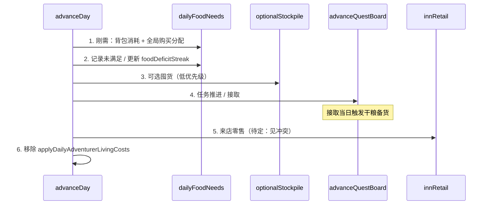
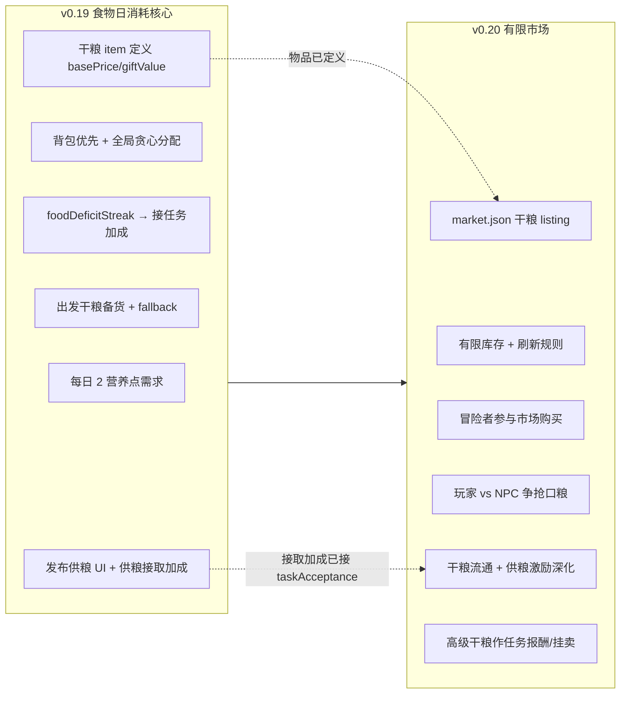

# v0.19 Adventurer Daily Needs（规划 → 待实现）

## 状态

**从「搁置」升级为待实现。** v0.19 **部分范围**：**食物日消耗核心**（每日需求 + 全局竞价分配 + 未满足经济压力 + 出任务干粮 + 发布供粮 UI + 供粮接取加成）。

**v0.19 不做**：有限市场联动、冒险者参与市场竞价、干粮市场流通与库存竞争 —— 见 [v0.20-limited-market-economy-plan.md](./v0.20-limited-market-economy-plan.md)。

卖东西行为 **v0.19 不做**，只预留压力字段与日志钩子；接任务意向增强（含供粮加成）**v0.19 落地**。

---

## 设计目标

把 v0.18 的抽象 `adventurerDailyLivingCost` 替换为可扩展的 **「每日需求（Daily Need）」** 框架：

- 按 **品类（category）** 配置（v1 只做 `food`）
- 每个在册冒险者每日结算一次该品类需求
- 不同供给物有不同 **营养值（nutrition）**
- 冒险者对可支付选项 **打分**，全城镇 **贪心分配** 有限供给
- 未满足时累积压力，影响接任务意愿（及未来卖货意愿）

---

## 核心规则（已确认）

### 1. 食物日需求

| 项 | v1 规则 |
|----|---------|
| 参与者 | `knownLevel !== "heard"` 的冒险者 |
| 每日需求量 | **2 营养点** / 人 / 天（固定；特性系统出来后再改） |
| 供给来源优先级 | **① 背包已有食物** → **② 玩家店库存** → **③ 市场（冒险者自付钱；v0.19 仍无限供给，v0.20 改为有限库存）** |
| 营养值 | 见下节「营养标定」；**干粮默认不是 1 点**，实现前在 config 定稿 |

### 2. 全局分配与调控公式

#### 2.0 流程概览

对每个仍有未满足需求的冒险者，对其 **可负担** 的每个食物选项计算 `score(adventurer, offer)`，再进入全局贪心循环（见 2.2）。

#### 2.1 调控公式（非「强者恒强」）

全局贪心选的是 **当前这一轮、这一个 offer 上** 的最高分，不是「厉害的冒险者永远优先」。

`score(adventurer, offer)` 必须满足：

| 原则 | 含义 |
|------|------|
| **因选项而异** | 同一冒险者对蛋糕、生食材、市场 `food`、不同价店菜 **分数不同**（偏好、单价、来源、营养效率各不同） |
| **因状态而变** | 分配一次后 **只重算该冒险者**：剩余需求↑、钱↓、刚吃过的品类产生边际递减 → 各 offer 分数都会变 |
| **因日而变** | 换一天时：钱包、店库存、需求缺口、未满足 streak 都变 → 整体分配结果不应复制前一天 |
| **可负担门槛** | 钱不够的 offer **不进池**，不是低分但仍参与 |

**建议公式骨架（实现时拆到 `foodScoring.ts`）**：

```
score =
  preferenceMatch(adventurer, offer)      // preferences 含 food 等
+ priceAppeal(greed, price, marketRef)  // 贵货对吝啬者分低
+ venueAffinity(source, acquaintance)   // 熟客更愿来店
+ nutritionFit(remainingNeed, nutrition)  // 快饿满时更倾向「不浪费」的小份；缺口大时倾向高营养
+ urgency(remainingNeed, deficitStreak) // 缺口越大越急，但不是全局 domination
- satietyPenalty(recentlyAllocatedSame) // 避免同人同日对同一 offer 无限刷分
```

**因此**：不会出现「某冒险者今天所有选项都是最高分」——除非只剩一个可负担选项；也不会「今天高分明天完全不变」，因为状态与日上下文都变了。

**真正需要防的边界**（替代原「不公平」表述）：

- **同分 tie-break**：须确定性规则（如 `adventurerId + offerId` 字典序），保证读档一致
- **店库存耗尽**：是供给不足，不是公式偏袒
- **极端价格**：店菜过贵时所有人市场分更高——属经济行为，不是人格等级

#### 2.2 全局分配循环（用户指定）

在 2.1 为每个 `(adventurer, offer)` 算分后，循环直到无未满足需求、或无可用选项：

1. 在所有 `(adventurer, offer)` 中取 **全局最高分**
2. 执行一次分配：扣钱 / 扣店库存 / 扣背包或加入背包；减少该冒险者剩余需求（按营养值）
3. **仅对该冒险者** 重算各 offer 分数（2.1 公式，状态已变）
4. 若某 offer 库存归零 → 从全局池移除
5. 若某冒险者再也买不起任何选项 → 从参与者列表移除

实现可做优化（堆 / 增量更新），但对外行为须与上述一致。

### 3. 未满足后果（v1）

- **不阻断**接任务、不扣熟悉度
- 累积 **`foodDeficitStreak`**（连续未凑满 2 点的天数）
- 接入 [`taskAcceptance.ts`](../../src/game/systems/quests/taskAcceptance.ts)：
  - `foodDeficitStreak` 越高 → `getEconomicAcceptanceBoost` / interest threshold 额外加成（按天递增）
- 若 **连续未满足且连续 N 天未接到任务** → 再叠一层加成（v1 只影响接任务；**卖货意向字段预留**，日志可记 `wouldSell=true`）
- **卖东西行为**：v1 **不实现**，接口留 [`adventurerEconomy.ts`](../../src/game/systems/economy/adventurerEconomy.ts) 扩展点

### 4. 背包食物优先（城镇 + 任务）

- 满足当日需求时，**先自动消耗 `carriedItems` 中标记为食物/干粮的条目**（按分数或固定顺序消耗 1 单位营养）
- 外出任务期间：**只吃背包**，不再参与镇上店/市场购买分配
- 设计预期：出发日备货后，任务期内应 **自带足够干粮**；意外断粮惩罚 **以后版本** 再做

### 5. 额外囤货意向（v1 轻量）

在 **所有人当日刚需** 分配完成后，空闲冒险者可再跑一轮 **低优先级** 购买：

- 是否想买、买多少：由 `greed`（负相关价）、`caution`（正相关囤货）、`carriedMoney`、当前背包食物量决定
- 买到后放入 `carriedItems`（或食物专用子结构，见实现）
- **不得抢占**他人尚未满足的刚需槽位（刚需轮次先结束）

### 6. 出任务干粮（与任务系统联动）

**触发时机**：冒险者 **接取任务出发当天**（[`taskBoard.ts`](../../src/game/systems/quests/taskBoard.ts) 中 `task_started` 前后），在 **当日进食需求全部结算之后**。

| 步 | 行为 |
|----|------|
| 1 | 计算备货需求：`quest.totalDays × 每日食物营养`（v1：×2 营养点） |
| 2 | 用同一套打分 + 分配，尝试从店/市场购入干粮放入背包 |
| 3 | 仍不足 → 使用 **任务绑定干粮**（低/中/高三级，配置化）自动补齐 |
| 4 | 干粮等级与任务模板风险/时长挂钩（v1 可先按 `quest.risk` 映射） |

**发布任务 UI 增强**（[`questsTab.ts`](../../src/game/ui/tabs/questsTab.ts)）：

- 显示 **推荐携带干粮**（按模板计算，均为干粮类 item）
- 可选：**由玩家从库存提供干粮**（勾选后发布时扣除玩家库存，直接进接取者背包，可减少其自购压力）
- 勾选供粮时写入 `playerProvisionedRations`，接取评估时应用 **供粮接取加成**（见「供粮与接取意愿」）

---

## 日循环顺序（建议）



### 与现有系统冲突（须处理）

| 冲突 | 建议 |
|------|------|
| [`innRetail.ts`](../../src/game/systems/economy/innRetail.ts) 随机买 food | v1 **关闭或降级**为叙事装饰，避免与刚需分配 **双重扣库存/双扣钱** |
| `adventurerDailyLivingCost` | 置 `0` 并删除扣款调用 |
| 任务中冒险者 | 不参与镇上购买；仅扣背包干粮营养 |

---

## 营养标定（为何是 2 点 / 干粮是否 =1）

### 营养点的含义

**每日 2 营养点** = 游戏内抽象的「一日最低膳食负荷」，不是现实卡路里。用于：

- 统一 **资源 / 菜品 / 干粮** 的换算
- 计算 **任务备货**：`totalDays × 2` 营养点
- 驱动 **分配与打分**（大份 vs 小份、是否浪费）

选 **2** 而不是 1 的原因：留出 **组合空间**（例如 2 份低价食材，或 1 份足量正餐），避免「全世界都是 1 单位=1 天」导致店菜与干粮无法分层。

### 各类食物建议标定（v1 草案，config 定稿）

| 供给 | 建议 nutrition | 叙事 / 玩法理由 |
|------|----------------|-----------------|
| `food` 资源（生食材） | **1** | 便宜、需凑 2 单位才满一日；鼓励组合或搭配店菜 |
| `stone-tower-cake`（店菜） | **2** | 一份管饱，体现饭店价值 |
| **低级干粮** | **2** | **按「一日路餐」打包**，不是 1 点；`totalDays` 天任务 ≈ 带 `totalDays` 份低级干粮 |
| **中级干粮** | **2**（或 2 + 副作用） | 同营养，更好携带/更低价感；或略增 `nutritionFit` 分 |
| **高级干粮** | **2～3** | 长途/高风险任务用；3 点可表示「一份顶 1.5 天」减少背包格压力（若以后有格数） |

### 干粮为什么 **不宜默认 nutrition = 1**

若低级干粮 = 1 点：

- 每日需求 2 → **每天要消耗 2 个干粮单位**
- 5 天任务 → **10 个干粮** 才够，背包与 UI 数字膨胀
- 与「一份干粮管一天路餐」的直觉不符

若低级干粮 = 2 点（**推荐默认**）：

- **1 份 = 1 天路餐**，任务备货 `totalDays` 份即可，和发布界面「推荐携带 N 份干粮」一致
- 生食材仍为 1 点，形成 **「便宜但麻烦」vs「干粮省心」** 的经济差

**高级干粮** 若 nutrition=3：表示「一份顶 1.5 天」；其余差异见下节 **干粮分级设计**（价格、保质期、任务加成、叙事档位、市场类目），**不靠 nutrition=1/2/3 硬凑三档**。

---

## 干粮分级设计

干粮三档为 **真实物品**（`config/items/trail-rations.json`），有 `basePrice`、`giftValue`、`nutrition`，**非任务专用幻影道具**。玩家可在背包持有、任务发布时供粮、（v0.20 起）在市场买卖。

### 分级对照表（规划默认，config 定稿）

| 档位 | itemId | 营养/包 | basePrice | giftValue | 按天增益 | 市场类目 | 叙事档位 |
|------|--------|---------|-----------|-----------|----------|----------|----------|
| **低** | `trail-ration-low` | **2** | 低 | 低 | 无 | `consumables.trail_ration` | 粗加工、管饱 |
| **中** | `trail-ration-mid` | **2** | 中 | 中 | 轻 capability buff（`duration: days`） | 同上 | 标准路粮 |
| **高** | `trail-ration-high` | **3** | 高 | 高 | 强 buff，可作任务报酬 | premium | 珍馐、酬劳感 |

### 差异化轴（实现与文案统一口径）

| 轴 | 低 | 中 | 高 |
|----|----|----|-----|
| **营养/包** | 2 | 2 | 3 |
| **价格** | 最便宜 | 中等 | 最贵 |
| **增益** | 无或极轻 | 按天 capability buff | 按天强 buff，可作任务报酬 |
| **叙事** | 基础路粮 | 标准冒险口粮 | 高级酬劳 / 赠礼 |
| **消耗模型** | `consumableModel: food`，无任务随行保质期 | 同左 | 同左 |
| **市场** | v0.20 上架可买卖 | 同上 | 同上 premium 类目 |

v0.19：物品与营养、fallback 映射、发布 UI 推荐量按上表 config 化；**市场 listing 与有限库存竞争延至 v0.20**（见跨版本路线图）。

任务模板 risk/时长 → 推荐干粮档位映射（v0.19 P4）：

| 任务特征 | 推荐档位 | fallback 补齐档位 |
|----------|----------|-------------------|
| 短途 / 低风险 | 低 | 低 |
| 中程 / 中风险 | 中 | 中（不足时降档补低） |
| 长途 / 高风险 | 高 | 高 → 中 → 低  cascade |

---

## 供粮与接取意愿

**同一任务模板**：发布时若玩家勾选 **「由店主提供干粮」** 并从库存扣除 → 接取者 `taskAcceptance` **额外正向修正**（与 [`taskAcceptance.ts`](../../src/game/systems/quests/taskAcceptance.ts) 现有 `getEconomicAcceptanceBoost` 并列，新增 `getProvisionAcceptanceBoost(quest)` 或等价字段）。

| 规则 | 说明 |
|------|------|
| 触发 | 任务创建时写入 `quest.playerProvisionedRations: { tier, quantity, nutritionTotal }`（或 item 列表快照） |
| 加成时机 | 评估接取意向时读取；**无供粮 = 0 加成**（模板本身不变） |
| 档位影响 | 低 < 中 < 高：加成幅度与 `giftValue` / 供粮 `basePrice` 总量挂钩 |
| 与缺钱叠加 | 与 `foodDeficitStreak`、`getEconomicAcceptanceBoost` **相加**（均为 threshold 侧加成，不重写人格骨架） |
| 转入背包 | 默认：`task_started` 时将玩家已扣库存转入接取者 `carriedItems`（与 §6 备货同日） |

建议 config（`daily-needs.json` 或 `quest-provisioning.json`）：

```json
{
  "provisionAcceptanceBoost": {
    "perNutritionPoint": 0.02,
    "tierMultiplier": { "low": 1.0, "mid": 1.25, "high": 1.6 },
    "cap": 0.15
  }
}
```

v0.19 **P5** 实现 UI + 扣库存 + 接取加成；**市场侧「供粮作为竞争激励」**（如稀缺高粮任务更抢手）在 v0.20 与有限库存一并深化。

---

## 高级干粮作为奖励

高级（及中档）干粮不仅是生存燃料，也是 **经济商品 + 叙事酬劳**：

| 用途 | 机制 |
|------|------|
| **任务报酬** | 任务模板 `rewards.items` 可含 `trail-ration-high`；完成时入冒险者背包，可自用、赠礼或（v0.20）挂市场 |
| **玩家赠礼** | 现有 [`gifting.ts`](../../src/game/systems/gifting.ts) 用 `giftValue` 算接受度；高粮 `giftValue` 高 → 更易被接受 |
| **定价锚点** | `basePrice` 用于市场买卖与零售参考；`giftValue` 仅赠礼（v0.15 分离原则） |
| **与供粮对称** | 玩家发布任务供高粮 ↔ 任务完成奖励高粮，形成「干粮流通」叙事闭环（经济闭环在 v0.20 有限市场完成） |

v0.19：config 定 `giftValue` / `basePrice`；任务报酬栏可配置高粮条目（若模板已有 items reward 则直接复用）。**冒险者主动挂卖、库存争抢** 不做。

### 实现注意

- 所有 nutrition 只写在 **config**（`daily-needs.json` + item 字段），便于调参
- `validate-config` 校验：干粮 nutrition ≥ 1，且任务推荐携带量 = `ceil(totalDays × dailyNutrition / rationNutrition)`

---

## 配置与数据（新增）

### `config/daily-needs.json`（建议草案 — 营养值为推荐默认，定稿前可改）

```json
{
  "categories": {
    "food": {
      "dailyNutrition": 2,
      "deficitAcceptanceBoostPerDay": 0.04,
      "deficitNoQuestExtraBoost": 0.06,
      "noQuestStreakThresholdDays": 3
    }
  },
  "nutritionByRef": {
    "resource:food": 1,
    "item:stone-tower-cake": 2,
    "item:trail-ration-low": 2,
    "item:trail-ration-mid": 2,
    "item:trail-ration-high": 3
  },
  "trailRations": {
    "low": { "itemId": "trail-ration-low", "nutrition": 2, "note": "1 pack = 1 day trail food" },
    "mid": { "itemId": "trail-ration-mid", "nutrition": 2, "note": "same nutrition; differentiate by price/risk mapping" },
    "high": { "itemId": "trail-ration-high", "nutrition": 3, "note": "optional 1.5-day pack for long quests" }
  }
}
```

> **勿在代码里写死 nutrition=1 给干粮。** 上表为规划推荐；实现时以 config + `validate-config` 为准。

### 新物品（干粮三档）

- `config/items/trail-rations.json` + 文本
- 属性：`category: "trail_ration"`、`nutrition`、`basePrice`、`giftValue`
- **真实物品**：可入玩家/冒险者背包；v0.20 加入 [`market.json`](../../config/market.json) listing（`buyable`/`sellable`）
- v0.19 fallback 补齐仍可用系统生成（等价于「任务绑定发放」），但 item 定义与市价/赠礼值须与玩家持有物一致

### 存档 Save v10（建议字段）

冒险者实例或全局：

- `foodDeficitStreak: number`
- `daysWithoutQuestWhileDeficit: number`（可选）
- `lastDayFoodNeedMet: boolean`（可选，便于调试）

玩家侧任务发布（若做玩家供粮）：

- 发布表单状态不入档，仅 quest 创建时一次性扣库存

---

## 实现分阶段（可分离模块）

### v0.19 范围：食物日消耗核心

| 阶段 | 模块 | 文件（建议） | 可独立验收 |
|------|------|--------------|------------|
| **P1** | 配置 + 营养读取 + 移除抽象扣款 | `dailyNeeds.ts`, config, `dayLoop` | 不再扣 `adventurerDailyLivingCost` |
| **P2** | 背包消耗 + 店/市场刚需分配器 | `foodAllocation.ts` | 日志可见谁吃了什么、钱/库存变化 |
| **P3** | 未满足压力 → `taskAcceptance` | `adventurerEconomy.ts`, `taskAcceptance.ts` | 饿久了更易接任务 |
| **P4** | 出任务干粮 + 任务模板推荐 + 三档 fallback | `questProvisioning.ts`, `questsTab` | 出发日背包增加干粮 |
| **P5** | 玩家发布时供粮 UI + 接取加成 | `questsTab`, `taskBoard`, `taskAcceptance.ts` | 勾选扣库存 + 接取意愿提升 |
| **P6** | 可选囤货轮 | `foodStockpile.ts` | 有钱会多买备用 |
| **延后 v0.20** | 有限市场、干粮 listing、库存竞争 | 见 v0.20 规划 | — |
| **延后 v2+** | 冒险者卖货 | — | 仅压力钩子 |

### 跨版本路线图



| 能力 | v0.19 | v0.20 |
|------|-------|-------|
| 每日进食 / 分配 | ✅ | 继承，市场源改为有限 |
| 未满足 → 接任务 | ✅ | 继承 |
| 出任务备货 / fallback | ✅ | 继承，可购源含有限市场 |
| 发布供粮 + 接取加成 | ✅ | 继承 + 与市场稀缺联动 |
| 干粮市场买卖 | ❌（物品就绪） | ✅ |
| 冒险者抢有限库存 | ❌ | ✅ |
| 高粮作报酬 / 流通 | 配置级 | 经济闭环 |

---

## 本方案的缺陷与风险

| 缺陷 | 说明 | 缓解 |
|------|------|------|
| **同分 / 确定性** | 多对 (人,货) 同分时需稳定 tie-break | `adventurerId + offerId` 字典序；分数全用确定性公式，不靠每轮 RNG |
| **店库存耗尽** | 供给不足导致有人未满足 | 记录 deficit；市场无限作兜底；玩家可补货 |
| **复杂度 / 性能** | 多人 × 多商品 × 多轮重算 | offer 池按库存实例化；小场景单测 |
| **与 innRetail 重复** | 两套买店逻辑 | v1 关闭 innRetail 食物购买 |
| **任务期断粮** | 后续再做惩罚 | 出发备货 + 干粮 fallback |
| **资源 vs 物品** | `food` 资源进背包还是即食？ | v1 统一为一种路径（建议：购入先进 carried，消耗时扣营养） |
| **营养标定漂移** | 改 config 影响旧存档任务推荐量 | 推荐量按发布日 config 快照或当日实时计算并注明 |
| **叙事量** | 多人多条进食 | 聚合 story |
| **卖压只做一半** | v1 无卖货 | 压力字段 + 文档 v2 |

---

## 仍待你拍板（非阻塞，有默认）

1. **玩家发布任务时供粮**：干粮在 **接取者出现那天** 才进其背包，还是 **发布时先锁在任务上**？  
   - **默认**：接取者确定并 `task_started` 时转入背包（与备货同日）。

2. **干粮营养标定**：是否采纳「低级/中级 = 2（一日路餐）、高级 = 3（可选半日加成包）」？  
   - **默认**：采纳；三档主要靠价格、任务 risk 映射、未来加成区分，而非都用 nutrition=1。

3. **`stone-tower-cake` 营养值**：  
   - **默认**：蛋糕 2，生食材 `food` 1。

4. **innRetail**：v1 **关闭**食物随机购买，只保留刚需分配带来的店收入。  
   - **默认**：关闭，避免双轨。

---

## 验收标准（v1）

- [ ] 每位在册冒险者每日尝试满足 2 营养点；优先背包，再店，再市场
- [ ] 分配行为符合全局最高分贪心规则（有测试用例）
- [ ] 连续未满足提高接任务倾向；连续未满足且久未接任务再加成
- [ ] 出发任务当天，在进食后尝试购买 `totalDays×2` 营养干粮；不足则干粮 fallback
- [ ] 任务进行中冒险者只吃背包，不参与镇上购买
- [ ] 发布任务 UI 显示推荐干粮；可选玩家供粮 + 供粮接取加成（P5）
- [ ] `adventurerDailyLivingCost` 不再生效
- [ ] Save v10 迁移；`validate-config` 覆盖新配置

---

## 跨版本引用

- 替代：[v0.18-adventurer-economy.md](./v0.18-adventurer-economy.md) 抽象每日扣款
- 依赖：[v0.17-inn-retail.md](./v0.17-inn-retail.md)、[v0.16-market.md](./v0.16-market.md)（v0.19 仍用无限市场兜底）、[v0.10-task-acceptance.md](./v0.10-task-acceptance.md)
- **后续**：[v0.20-limited-market-economy-plan.md](./v0.20-limited-market-economy-plan.md) — 有限库存、干粮流通、市场争抢、报酬闭环
- 远期：冒险者卖货、断粮惩罚

## 结果记录

- 2025-06：初版规划搁置
- 2026-06：按用户细化需求更新——每日需求框架、全局分配、未满足压力、出任务干粮、背包优先、囤货意向；卖货延后 v2
- 2026-06：干粮分级轴、供粮接取加成、高粮作奖励；v0.19/v0.20 分阶段，有限市场移交 v0.20
- 2026-06：澄清调控公式非「强者恒强」；新增营养标定专节；干粮默认按「一日路餐=2 营养」推荐，非 nutrition=1
