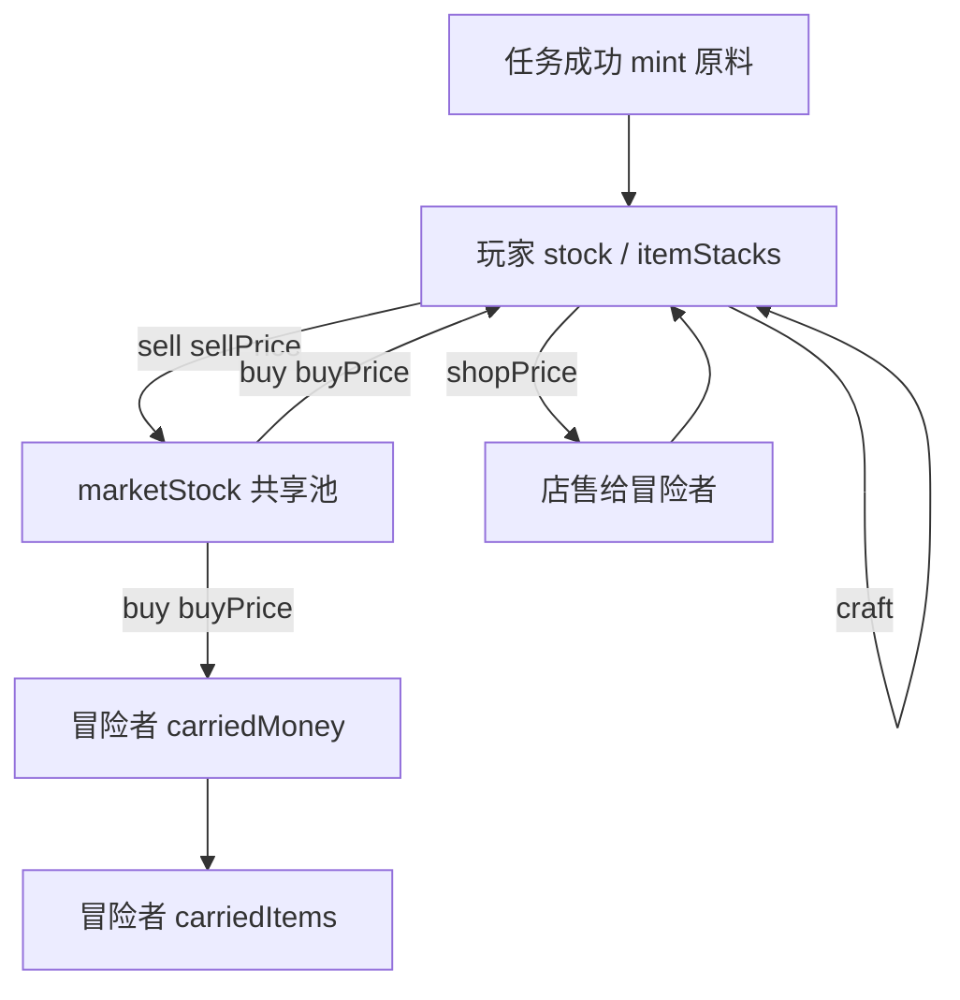
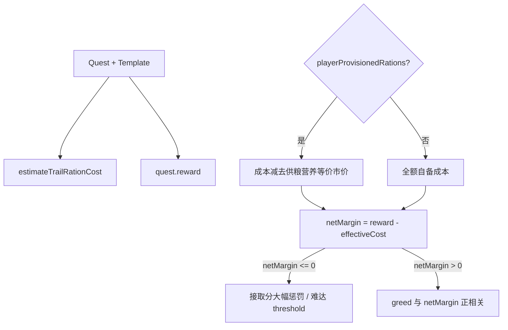
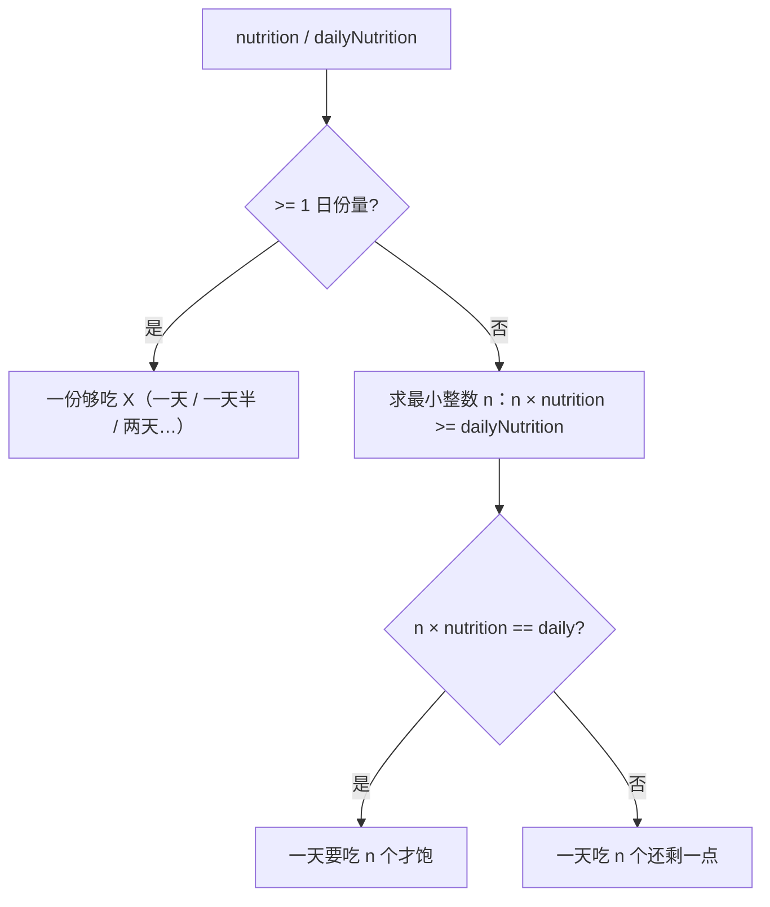
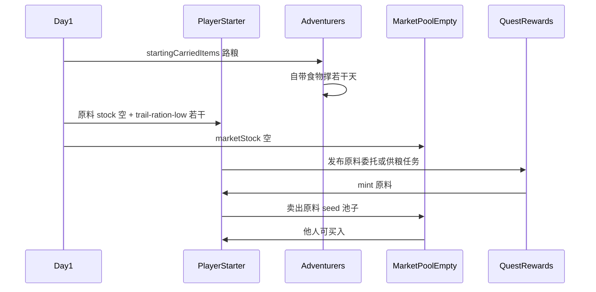

# v0.21 饭店有限市场（规划 · 待 v0.19 后启动）

> **版本说明：** 本文档吸收并 **替代** [v0.20-limited-market-economy-plan.md](./v0.20-limited-market-economy-plan.md) 中与之 **冲突** 的设计项（守恒池、买卖价差、饭店专精原料体系、任务口粮经济、饱食度文案等）。v0.20 中未被本文覆盖且仍适用的条目（如供粮稀缺加成思路）可继续参考，但以本文为准。

## 状态

**未开始。** 前置：[v0.19-adventurer-activity-module-plan.md](./v0.19-adventurer-activity-module-plan.md) 食物日消耗核心完成后转入本迭代。

## 为何单独成篇

v0.19 只定义物品、营养、分配与接取加成；**有限库存、守恒流通、饭店专精经济** 不应在 v0.19 里用「无限市场 + 孤立规则」硬凑。v0.20 已规划有限市场方向，但未覆盖饭店专精、守恒池、买卖价差、多原料体系与任务口粮成本挂钩等核心约束；v0.21 在 v0.20 基础上 **重做并细化** 上述设计。

---

## 本次目标

1. 市场从「玩家专属、无限供给、买卖同价」升级为 **守恒库存池 + 买卖价差**
2. 饭店经济 **专精化**：删除 wood/stone/treasure 及非饭店市场项；以 **5 种原料** 替代泛化 `food` 资源
3. 任务模板与原料产出 **一一对应**；报酬须 **严格大于** 冒险者自备路粮成本
4. 冒险者参与市场采购时与玩家 **争抢同一守恒池**；移除路粮虚空 fallback
5. 玩家 UI **不展示营养数值**，改用 **饱食度口语文案**
6. 冷启动：玩家开局少量低级路粮、无原料；冒险者自带路粮；锚点长期挨饿触发特殊对话
7. **黑市** 仅 config/类型预留，本迭代不实现

---

## 依赖 v0.19 交付物

| v0.19 产出 | v0.21 用法 |
|------------|------------|
| `trail-ration-low/mid/high` 物品 + nutrition/basePrice/giftValue | 挂牌 market listing；供粮与路粮成本估算锚点 |
| `provisionAcceptanceBoost` | 叠 `getAdventurerEconomicPressure`；缺钱 × 供粮加成 |
| `foodAllocation` 市场源 | 改为扣减有限 `marketStock`，读 `buyPrice` |
| `quest.playerProvisionedRations` | 与口粮成本估算、接取门槛联动 |

---

## 设计原则

| 原则 | 设计落点 |
|------|----------|
| 所有 **物品** 可流通 | `market.json` 挂牌覆盖全部 food 类物品（蛋糕、路粮等）；原料走 `resource` |
| 买卖有损耗 | 统一 `buyPrice > sellPrice`（玩家与冒险者同一套市价） |
| 市场不虚空 | 运行时 `marketStock` 守恒：买入扣池、卖出入池 |
| 饭店专精 | 删除 wood/stone/treasure 及非饭店市场项；任务改为原料获取 |
| 5+ 原料小类 | 替代单一 `food` 资源，不同价、不同菜谱 |
| 数值可膨胀 | 内部可用 ×10 或 ×1000 营养整数；不强制整体缩表 |
| 黑市 | 仅 config/类型预留，本迭代不实现 |

---

## 关键规则

### 1. 守恒市场池（marketStock）

**单一守恒池**（首版）：`gameData.market.stock: Record<MarketRefKey, number>`，key 形如 `resource:wheat` / `item:trail-ration-low`。



- 玩家/冒险者任何「从市场拿货」→ **池减、持有者增、付 `buyPrice`**
- 任何「向市场出货」→ **池增、持有者减、收 `sellPrice`**
- **任务奖励**：只增加玩家持有，**不** 自动进池（玩家选择卖入才进池）
- 玩家/冒险者共用同一池；按 `marketId` 分池（为黑市预留）

**须封堵的现有漏洞：**

| 漏洞 | 风险 |
|------|------|
| 买入 = 凭空造物（`buy*FromMarket` 只扣钱 `addStock`） | 破坏守恒核心 |
| 卖出 = 凭空销毁（`sell*ToMarket` 只加钱，无市场池） | 货物消失，池子永远补不齐 |
| 冒险者无限市场（`stock: Number.MAX_SAFE_INTEGER`） | 与有限市场目标直接冲突 |
| 路粮 fallback 造物品（`questProvisioning.ts`） | 守恒外循环；应改为池内购买 → deficit / 锚点剧情 |

**非漏洞但须知晓的设计选择：**

- 任务 mint 仍是经济「水龙头」：增加玩家持有，不直接增加 `marketStock`；靠任务酬金扣款 + 买卖价差 + 配方损耗回收
- **玩家店 ≠ 市场**：冒险者买店货扣玩家库存、钱给玩家；不经过 `marketStock` — intentional 双通道
- 店价套利：建议规则「店价不得低于 `sellPrice`」或「不得低于 anchor 价」— 实现可选 P2.5
- 池子枯竭：冒险者/玩家同抢；日志 + deficit 已是后果；锚点对话补叙事

### 2. 买卖价差（buy/sell spread）

在 `pricing.ts` 或新 `config/market-pricing.json`：

```
anchorPrice = resource.basePrice | item.basePrice
buyPrice  = ceil(anchorPrice * buyMultiplier)   // 例 1.3
sellPrice = floor(anchorPrice * sellMultiplier)  // 例 0.7
约束: buyMultiplier > sellMultiplier，且对同一锚点 buyPrice > sellPrice
```

- 冒险者交易 **必须使用同一 buy/sell**，在 `foodAllocation.ts` 的 market offer 上读池库存与 `buyPrice`
- 当前实现单一 `basePrice` 买卖同价 → 须改为双价展示与交易

### 3. 五种原料

删除资源：`wood`, `stone`, `treasure`, 泛化 `food`。

| id | 叙事 | 建议 anchor 价 | 角色 |
|----|------|----------------|------|
| `wheat` | 小麦 | 2 | 面食、基础碳水 |
| `rice` | 稻米 | 3 | 炒饭、路粮 |
| `mutton` | 羊肉 | 5 | 荤菜、高价蛋白 |
| `greens` | 时蔬 | 2 | 素菜、便宜填充 |
| `salt` | 盐 | 1 | 调味、极低价 |

- 文本放 `config/text/resources/`（新建 `ingredients.json` 或扩展现有 basic）
- 原料 **可生吃**，营养极低；`foodScoring` 中偏好极低，仅「无更好选择」时吃
- 冒险者 `preferences` 从 `wood/treasure` 改为原料 id 或新标签 `ingredient` + 具体 id

**任务模板改造（与原料对齐）：**

| 原模板 | 处置 | 新设计 |
|--------|------|--------|
| `prologue-pantry-restock` (`food`) | 改 | `resource: rice` 或 `greens`（入门廉价原料） |
| `prologue-riverside-wood` | 删/换 | `prologue-mutton-run` → `resource: mutton` |
| `prologue-hearth-stone` | 删/换 | `prologue-wheat-harvest` → `resource: wheat` |
| 调查 intel 线 | 保留 | 无 resource 产出，报酬偏低但无备货成本 |

- 至少 **5 个可重复 stock 委托**，各覆盖一种原料（或 4 委托 + 1 混合高档）
- `resultItems`（蛋糕）保留为加工品水龙头；**原料任务只 mint `resource`**
- 删除市场 listing：`market-wood`, `market-stone`, `market-healing-potion`（药水非饭店线）

**营养与配方模型：**

- 内部单位：`nutritionMilli`（×1000 整数）或 ×10 整数，避免浮点存档
- 原料贡献（示例）：`{ wheat: 100, rice: 100, mutton: 150, greens: 80, salt: 0 }`（定稿进 config）
- 日需仍为 2000 milli（= 2.0 点），不必改 UI 显示习惯

| 配方档位 | 规则 | 示例 |
|----------|------|------|
| `simple` | `outputNutrition = floor(sum(inputNutrition) * 1.1)` 上限 cap | 羊肉 5×0.1 + 米 3×0.1 → 0.9 |
| `mid` | `outputNutrition = floor(sum * 0.95)` | 微损耗 |
| `premium` | `outputNutrition = floor(sum * 0.7)` | 大损耗；靠 buff/售价/叙事 |

**建议默认配方草案：**

| 配方 | 档位 | 输入 | 输出 |
|------|------|------|------|
| craft-trail-ration-low | simple | rice×2 + salt×1 | trail-ration-low |
| craft-trail-ration-mid | mid | low×1 + mutton×1 | trail-ration-mid |
| craft-trail-ration-high | premium | mid×1 + mutton×2 + greens×2 | trail-ration-high |
| craft-mutton-fried-rice | simple | mutton×2 + rice×3 + salt×1 | 新菜品或 mid 路粮 |
| craft-stone-tower-cake | premium | wheat×4 + salt×1 + … | stone-tower-cake |

### 4. 任务口粮成本经济（quest trail cost economics）

**核心约束：** 冒险者接任务隐性成本 ≈ **任务期自备路粮**；**报酬须严格大于口粮成本**，否则几乎无人主动接取。

**口粮成本估算公式：**

```
estimatedTrailCost(quest) =
  recommendedQuantity(quest) × getItemMarketBuyPrice(recommendedRationItemId)
// recommendedQuantity = ceil(totalDays × dailyNutrition / rationNutrition)
// totalDays 用模板 typical quantity=1 的估算天数

minViableReward = estimatedTrailCost + margin
// margin：config 化，建议至少 +1～+3 钱或 +10%～20%
```

- 模板 `minReward` ≥ `minViableReward`（`validate-config` 校验）
- `getRecommendedRewardForTemplate` 改为 `max(原公式, minViableReward)`
- **intel 调查任务**：无备货路粮成本（或仅 1 天极低成本），维持低酬；与 stock 线区分

**接取意愿：口粮成本门槛**



**实现要点：**

1. **`effectiveTrailCost(adventurer, quest)`**
   - 基础：按 quest.risk → 推荐档位 × 数量 × **市场 buyPrice**（有限市场下无货时成本视为极高 → 更不接）
   - 若 `quest.provisionRations`：减去玩家供粮部分营养 × 对应物品 buyPrice
2. **接取分修正**（叠在现有 `greedBonus` 旁，不替换人格骨架）：
   - `netMargin = quest.reward - effectiveTrailCost`
   - `netMargin <= 0` → 接取分 **-0.5～-1.0** 量级惩罚
   - `netMargin > 0` → `+ normalize(netMargin) * greedWeight`
3. **缺钱 × 供粮**：
   - `getProvisionAcceptanceBoost` 现有逻辑保留
   - 新增 `getProvisionAcceptanceBoostUnderPressure`：`economicPressure < 0` 时 `provisionBoost *= (1 + brokeMultiplier)`（建议 1.5～2.0）
4. **移除路粮 fallback 后**：接取评估用的成本与出发日实际能买到的市价一致；评估可用「当前市场池有货则用 buyPrice，无货则按惩罚高价或 infinity」

**发布任务 UI：**

- 展示「预估路粮成本 / 建议最低酬金」
- 供粮勾选时动态显示冒险者接取优势

### 5. 饱食度 UI 文案规则（satiety copy）

**原则：** 玩家界面 **永远不展示**「营养值 / 2.0 点」等数字；只展示与 **「一日饱食」** 相关的口语描述。游戏内日需仍为 `dailyNutrition`（当前 2.0 点，内部可用毫数），文案以此为「吃饱一天」的基准。

**文案规则（`getSatietyDescription`）：**

输入：`nutrition`（单份营养）、`dailyNutrition`（默认 2）。



| 营养（日需=2） | 生成文案示例 |
|----------------|--------------|
| 3.0 | 一份够吃 **一天半** |
| 2.0 | 一份够吃 **一天** |
| 1.0 | 一天要吃 **两个** 才饱 |
| 0.7 | 一天吃 **三个** 还剩一点（0.7×3=2.1>2） |
| 0.5 | 一天要吃 **四个** 才饱（0.5×4=2） |

**天数取整口语化（`formatSatietyDays`）：**

- `1.0` → 「一天」；`1.5` → 「一天半」；`2.0` → 「两天」；`2.5` → 「两天半」
- 其他小数：优先半日粒度；更小余量用「还剩一点」而非「0.1 天」

**「还剩一点」判定：** `n * nutrition - dailyNutrition <= dailyNutrition * 0.15`（config 化 `surplusHintThreshold`），否则若仍不足一日用「一天要吃 n 个才饱」。

**实现位置：**

- 新 `src/game/text/satietyText.ts`：`getSatietyDescription` / `formatSatietyDays` / 多份聚合 `getStackSatietySummary`
- **运行时拼接**，不往 `config/text/items/` 写死数字；`playerDescription` 保留叙事，饱食句另起一行或后缀
- 挂载点：库存 `viewModels.ts`、市场/制作 `marketTab.ts`、赠礼 `gifting.ts`、任务供粮 `questsTab.ts`（「推荐携带 N 份，约够吃 X 天」用份数 × 单份饱食聚合，仍不显示营养点数）；原料 `resource` 行同样适用

**与冒险者系统的边界：**

- 冒险者 AI / `foodScoring` **仍用数值营养** 做计算；仅 **玩家可见 UI** 用饱食文案
- 日志 `storyText` 现有「+{nutrition} 营养」可逐步改为饱食口语（低优先级）

### 6. 冷启动（cold start）



**玩家开局**（`state.ts` / 新建 `config/player-starter.json`）：

- `inventory.itemStacks["trail-ration-low"]`：建议 **3～5**（够发布 1～2 次供粮或应急，不够长期自给）
- `player.stock`：五种原料均为 **0**
- `marketStock`：**0**（守恒）

**冒险者开局**（`config/adventurer-starter.json` 或 archetype/anchor）：

- `startingCarriedItems`：如 `trail-ration-low` ×3（锚点可更多，如 ×5）
- `startingCarriedMoney`：保持现有或略调

**锚点挨饿对话**（`anchor-a`，`anchors.json`）：

- 触发：`roleType===anchor` && `foodDeficitStreak >= N`（建议 3～5）
- 实现：`adventurerAppearance.ts` 或 loadout 对话 + `storyText` 新 key；与 `bailout.ts`（玩家缺钱）区分

### 7. 黑市（placeholder，本迭代不实现）

`market.json` 扩展字段草案：

```json
{ "marketId": "town-legal", "buyMultiplier": 1.3, "sellMultiplier": 0.7, "listings": [...] }
{ "marketId": "black", "buyMultiplier": 1.6, "sellMultiplier": 0.5, "listings": [...], "enabled": false }
```

- 存档与 UI 按 `marketId` 分池，避免以后重构
- 本迭代 **不实现** 黑市逻辑与 UI；仅预留 config 结构与类型

---

## 本次范围（实施分阶段）

| 阶段 | 内容 |
|------|------|
| **P0** | 本文档落地；吸收 v0.20 冲突部分 |
| **P1** | 5 原料 config + 删除 wood/stone/treasure + 任务模板/报酬/偏好/establishment 全量对齐 |
| **P1b** | 任务口粮成本估算 + 接取门槛 + 供粮×缺钱加成 + 发布 UI 最低报酬提示 + validate-config |
| **P2** | marketStock + buy/sell 价差 + market.ts 守恒交易 + Save v11 + UI 双价与池存量 |
| **P3** | foodAllocation/questProvisioning 接有限池，移除路粮虚空 fallback |
| **P4** | 营养毫数、配方 tier 效率、foodScoring 原料低欲望、crafting 重做 |
| **P4b** | 饱食度文案生成器 + 库存/市场/赠礼/制作/供粮 UI 挂载 |
| **P5** | 冒险者 startingCarriedItems + anchor-a 长期缺粮特殊对话 |
| **P6** | market.json 全 food 物品挂牌 + establishment 类目修正 |

---

## 明确不做（首版）

- 黑市逻辑与 UI（仅 config 预留）
- 多城镇 / 多市场（除 `marketId` 类型预留外）
- 冒险者 P2P 交易
- 复杂拍卖行 UI
- 玩家向市场挂卖（至少 v0.21 首版不做）

---

## 验收标准

- [ ] 市场买入后 `marketStock` 减少、玩家持有增加；卖出反之；无单向虚空
- [ ] 任意挂牌：`buyPrice > sellPrice`；冒险者与玩家同价
- [ ] 仅 5 种原料 + food 物品在饭店经济中可任务获得、制作、买卖
- [ ] wood/stone/treasure 任务与 listing 移除后构建/校验通过
- [ ] 每个 stock 任务模板产出对应原料，`minReward` 高于预估路粮成本
- [ ] 酬金 ≤ 口粮成本的委托：已知冒险者几乎不接；供粮后接取率明显回升
- [ ] 缺钱冒险者对「玩家供粮」任务接取意愿高于同酬无供粮任务
- [ ] 冒险者开局背包有路粮；玩家开局有少量低级路粮、无原料
- [ ] 发布 UI 可见路粮成本与建议最低报酬
- [ ] 原料仅绝境食用；成品/店菜优先
- [ ] 简单/中级/高级配方营养符合效率档位
- [ ] 食物/原料 UI 仅显示饱食口语（一天半、一天吃三个还剩一点），不显示营养点数
- [ ] 锚点长期挨饿触发特殊对话
- [ ] Save v11 迁移可玩

---

## 跨版本引用

- 前置：v0.19（食物日消耗）、v0.16-market、v0.18-adventurer-economy、v0.17-inn-retail
- 替代冲突项：[v0.20-limited-market-economy-plan.md](./v0.20-limited-market-economy-plan.md)
- 后续：黑市实装、冒险者自主卖货完整版、地区经济

## 结果记录

- 2026-06：由 `.cursor/plans/饭店有限市场设定` 落档为 v0.21 迭代文档，吸收 v0.20 并细化守恒池、价差、5 原料、任务口粮经济、饱食文案、冷启动与黑市预留
